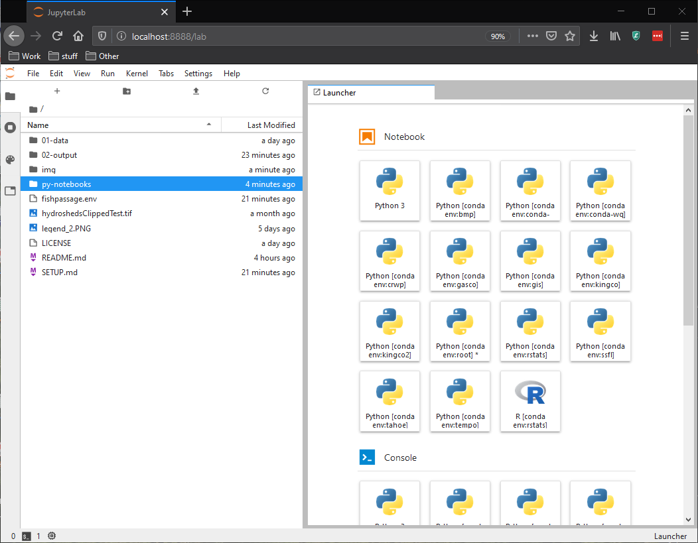
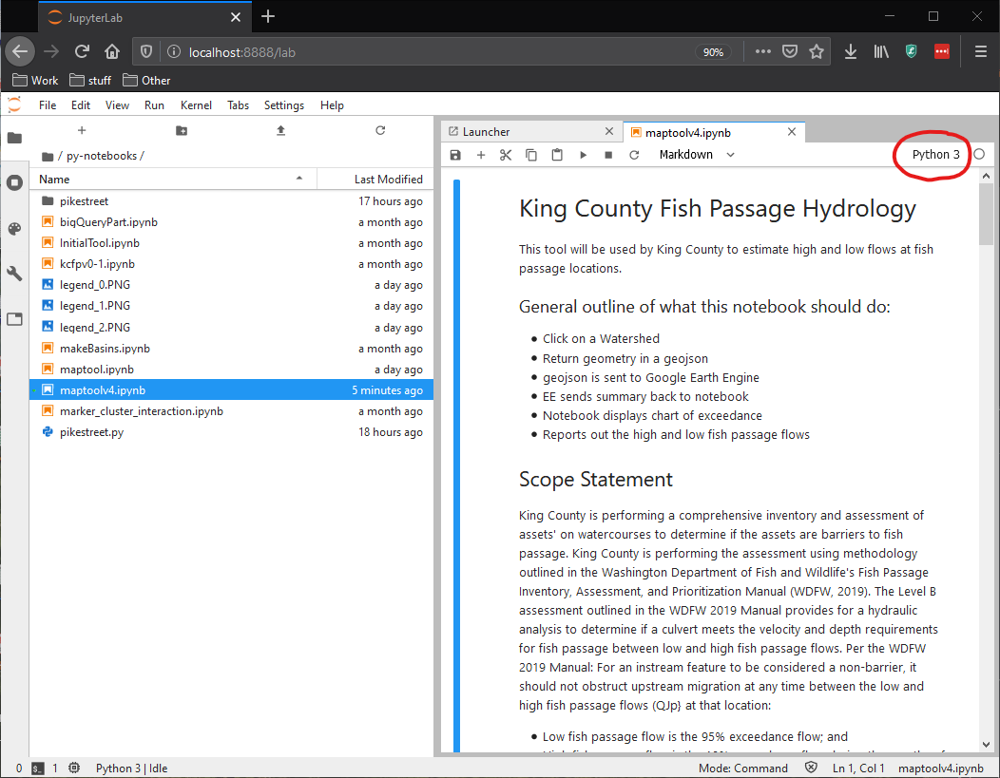
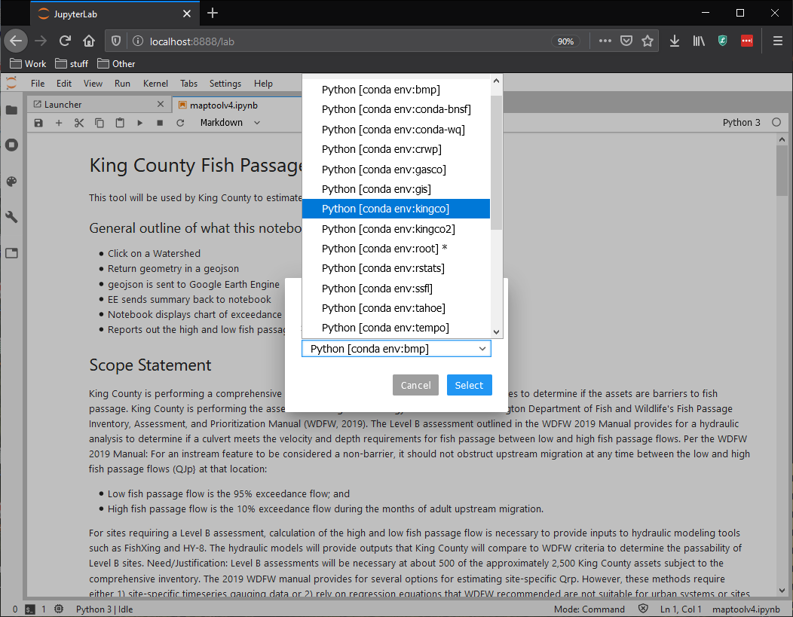
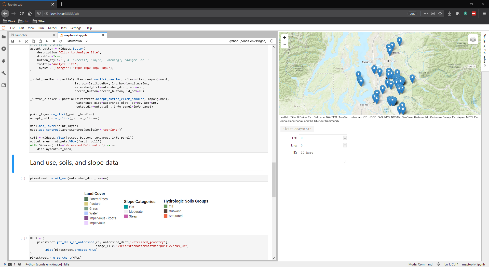
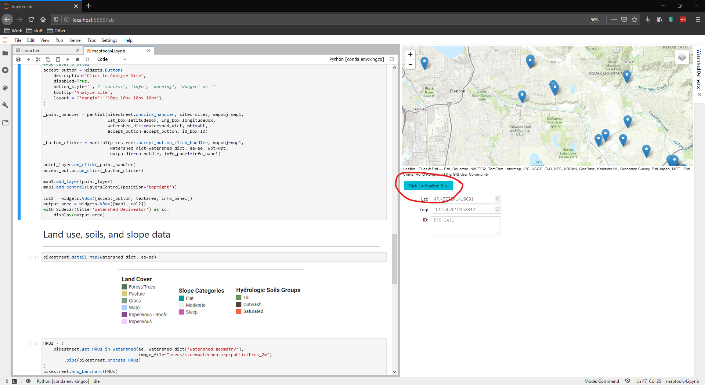
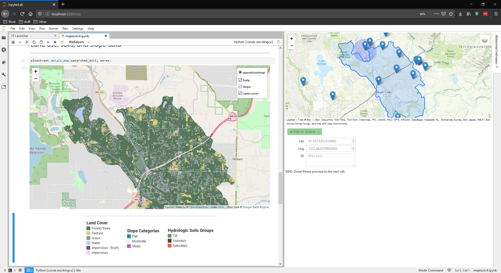

# Setting Up the Fish Passage Tool in Windows with Conda

## Installing Conda

The most direct way to set up a Windows computer to use the Fish Passage Tool in Windows is to use the `conda` package manager.
`conda` is a command line-based tool to install scientific packages from central repositories known as "channels".
You may already have `conda` installed on your machine with a recent version of ArcPro.
You can test this out by running the following on the command line:

```bash
> conda --help
```

If the output looks like the text below, you can skip to the "Setting up Your Environment" section.

```text
usage: conda [-h] [-V] command ...

conda is a tool for managing and deploying applications, environments and packages.

Options:

positional arguments:
  command
    clean        Remove unused packages and caches.
    config       Modify configuration values in .condarc. This is modeled
                 after the git config command. Writes to the user .condarc
                 file (/home/paul/.condarc) by default.
    create       Create a new conda environment from a list of specified
                 packages.
    help         Displays a list of available conda commands and their help
                 strings.
    info         Display information about current conda install.
    init         Initialize conda for shell interaction. [Experimental]
    install      Installs a list of packages into a specified conda
```

If you don't see this, but you do have ArcPro installed, you may need to add `conda` to your system path.
See [this article](https://www.computerhope.com/issues/ch000549.htm) for more information.

If you know `conda` is not on your machine, we recommend [installing miniconda](https://docs.conda.io/en/latest/miniconda.html).
Download the 64-bit, Python 3.7 installer for Windows.
Open the installer by double clicking, and follow the wizard.
We recommend the following options:

* install for your user account only (i.e., not "all users")
* at the end of the wizard, make the selection necessary to add `conda` to the system path

You may need to restart your machine after installation.
In any case, close any existing command prompts, open a new command prompt, and run `conda --help` again to test that the installation was successful.

## Creating your environment

Once `conda` is installed and usable from the command prompt, we can create the environment from which we'll run the Fish Passage Tool.
To do so, first navigate to the py-notebooks directory of the folder structure.
On my machine that looks like this in a fresh command prompt:

```text
Microsoft Windows [Version 10.0.18362.535]
(c) 2019 Microsoft Corporation. All rights reserved.

C:\Users\phobson>cd sources\kingcofishpassage

C:\Users\phobson\sources\kingcofishpassage>
```

The first thing we need to do is installl `jupyter lab` in the default (i.e. base) environment.
Note that from this point forward, the prompt (left hand text) will be replaced with a simple chevron (`>`):

```bash
> conda install jupyterlab notebook
```

The program will require a little bit a time to make sure all of the dependencies can be met, and then will present you with a list of packages that will be downloaded and installed.
When prompted, type `y` and hit <kbd>Enter</kbd> to confirm that you'd like to complete the installation.

After that, we need to create a new, Fish Passage Tool-specific environment with the `conda create` command.

```bash
> conda create --name=kingco --file=fishpassage.env
```

This instructs `conda` to download and install all of the packages listed in the fishpassage.env file.
Similar to the above, hit `y` and hit <kbd>Enter</kbd> when prompted.

Once all the packages have been downloaded and installed, `conda` should provide some instructions all the following lines:

```text
#
# To activate this environment, use
#
#     > conda activate kingco
#
# To deactivate an active environment, use
#
#     > conda deactivate
```

Now, as the help says, we need to activate the environment and install one more package called "sidecar" that is not available through conda.
Together, those steps look like the following:

```text
> conda activate kingco
(kingco)> pip install sidecar
```

Note that atfter activating the environment, the prompt should change to include the environment's name.
The installation command may produce a lot of text, but the very botoom will say something like:

```text
Installing collected packages: sidecar
Successfully installed sidecar-0.3.0
```

...if the installation completed successfully.

## Running the Fish Passage Tool

At this point, we're ready to run this Fish Passage Tool.
Doing so consists of the following steps:

1. *Deactivating* the `kingco` environment;
1. Launching Jupyter Lab;
1. Navigating to the notebook;
1. Executing and interacting with the notebook

Put together with the command prompt we've been using, the first two steps are the following:

```bash
(kingco)> conda deactivate
> jupyter lab
```

If you've opened up a fresh command prompt, you'll do the following:

```bash
> cd C:\Users\<username>\<folder_with_tool>kingcofishpassage
> jupyter lab
```

After executing Jupyter Lab, a new browser tab should open and you should see the Jupyter Launcher:



Naviate into the `py-notebooks` directory and lauch `maptoolsv4.ipynb`:



At this point, the kernel (i.e., python interpreter) may not point to the "kingco" environment that we created (circled red above).
Click on the upper right to select the "kingco" kernel.



Now we start executing cells.
My prefered way to execute a cell is to click inside a cell and then hit <kbd>Shift</kbd>+<kbd>Enter</kbd>.
Eventually, you'll execute a cell that brings up a map to the right hand side:



You can interact with map by panning and zooming as you do with most web maps (e.g., Google Maps).
The marks represet the fish passages.
If you select a point by clicking the marker, its info will show up below the map:



Before you move on to the rest of the notebook, you need to click the button circled read to delineate the site's watershed.
After you see the watershed appear on the map, you can execute the next cell to create and interact with a detailed map of the HRU characteristics of the watershed



Executing the rest of the cells will display tables and graphs related to the hydrology of the watershed.
